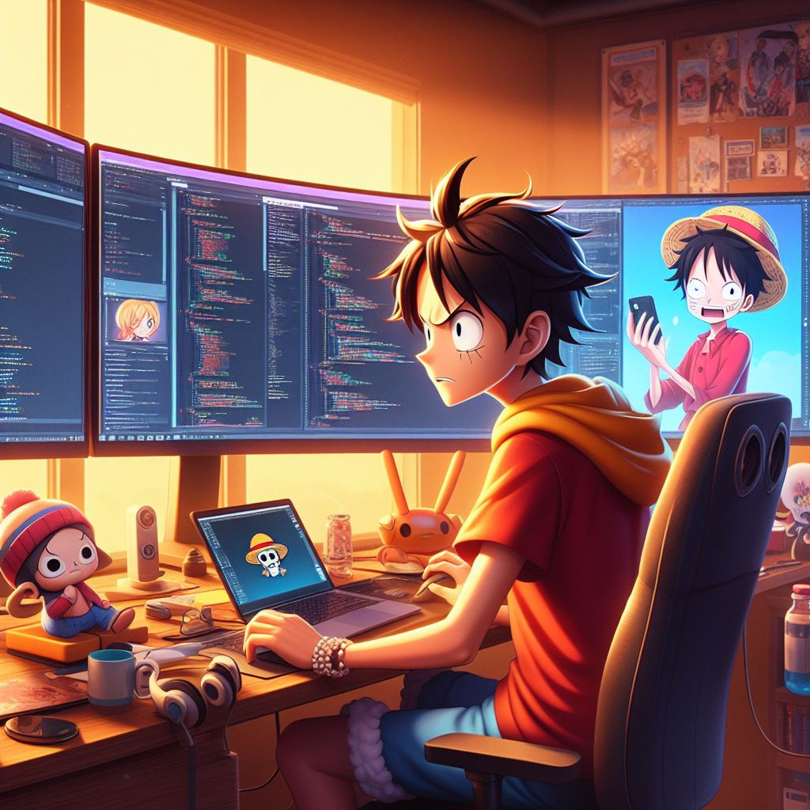

hi, i'm [Ebisa Dugo](https://portfolio-ead8.vercel.app/),computer science graduate with a passion for problem-solving through software development. I love building software that automates tasks and working with technologies like Next.js. I also prioritize clean code, system design, and delivering high-quality work. My goal is to be a passionate problem solver through technology.

<!-- i am also an open-source enthusiast and maintainer. i learned a lot from the open-source community and i love how collaboration and knowledge sharing happened through open-source. -->


  
  
- 💼 any freelance work? do reach, [email](mailto:eabisaadw@gmail.com) :)
- 💬 ask me about anything, i am happy to help;

**languages and tools:**  

<code></code>
<code></code>
<code></code>
<code></code>
<code></code>
<code></code>
<code></code>
<code></code>
<code></code>
<code></code>
<code></code>


📊 **this week i spent my time on:**
<!--START_SECTION:waka-->

```txt
TypeScript   15 hrs 28 mins  █████████████████████▓░░░   86.16 %
Python       1 hr 3 mins     █▒░░░░░░░░░░░░░░░░░░░░░░░   05.86 %
Go           40 mins         █░░░░░░░░░░░░░░░░░░░░░░░░   03.79 %
Bash         26 mins         ▓░░░░░░░░░░░░░░░░░░░░░░░░   02.49 %
Other        9 mins          ▒░░░░░░░░░░░░░░░░░░░░░░░░   00.84 %
```

<!--END_SECTION:waka-->


🚧 **my todoist stats:**
<!-- TODO-IST:START -->
🏆  8,004 Karma Points           
🌸  Completed 0 tasks today           
✅  Completed 301 tasks so far           
⏳  Longest streak is 11 days
<!-- TODO-IST:END -->


📈 my github stats

<p align="center"> 


